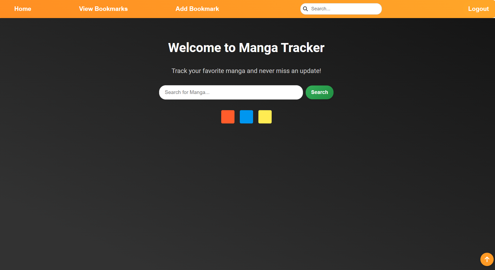
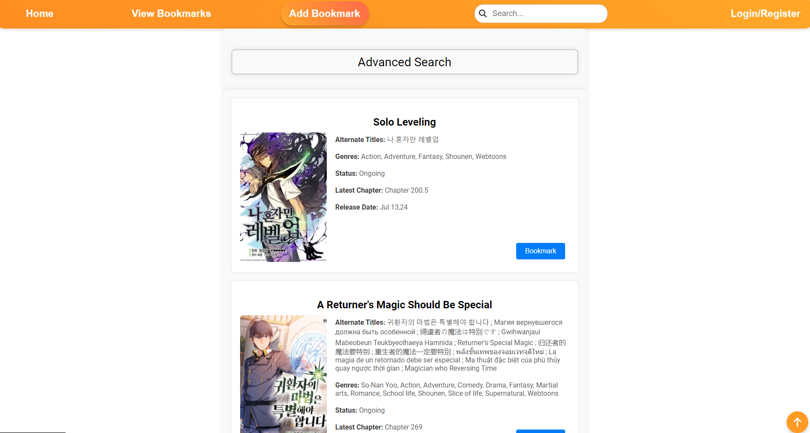
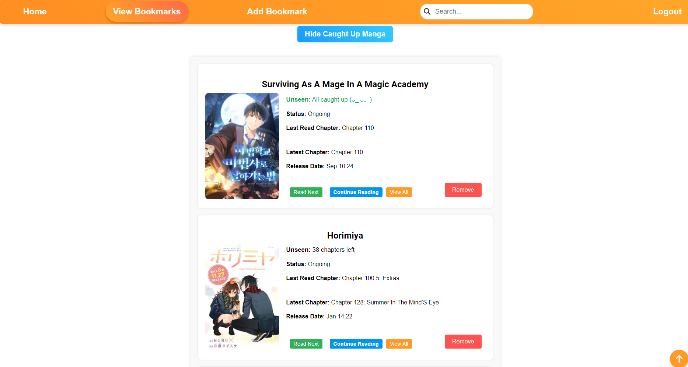

# Manga Tracker

Manga Tracker is a web application that helps you track your favorite manga and never miss an update! Made as a personal project, likely to be adapted to a browser extension in the future.

## Table of Contents

- Features
- Installation
- Configuration
- Usage
- Preview
- API-Endpoints

## Features

- Search for manga
- Track your favorite manga
- View all chapters
- Bookmark manga

## Installation

### Backend

1. Navigate to the [`backend`](command:_github.copilot.openRelativePath?%5B%7B%22scheme%22%3A%22file%22%2C%22authority%22%3A%22%22%2C%22path%22%3A%22%2Fc%3A%2FUsers%2Fmoham%2F.vscode%2FManga-Tracker%2Fbackend%22%2C%22query%22%3A%22%22%2C%22fragment%22%3A%22%22%7D%2C%22cfb9b299-b0d8-4675-93a2-3f39c699b6b6%22%5D "c:\Users\moham\.vscode\Manga-Tracker\backend") directory:
    ```sh
    cd backend
    ```
2. Install the dependencies:
    ```sh
    npm install
    ```
3. Start the backend server:
    ```sh
    npm start
    ```

### Frontend

1. Navigate to the [`frontend`](command:_github.copilot.openRelativePath?%5B%7B%22scheme%22%3A%22file%22%2C%22authority%22%3A%22%22%2C%22path%22%3A%22%2Fc%3A%2FUsers%2Fmoham%2F.vscode%2FManga-Tracker%2Ffrontend%22%2C%22query%22%3A%22%22%2C%22fragment%22%3A%22%22%7D%2C%22cfb9b299-b0d8-4675-93a2-3f39c699b6b6%22%5D "c:\Users\moham\.vscode\Manga-Tracker\frontend") directory:
    ```sh
    cd frontend
    ```
2. Install the dependencies:
    ```sh
    npm install
    ```
3. Start the frontend development server:
    ```sh
    npm start
    ```

## Configuration

Before running the backend server, you need to fill in the [`mongo.env`](command:_github.copilot.openRelativePath?%5B%7B%22scheme%22%3A%22file%22%2C%22authority%22%3A%22%22%2C%22path%22%3A%22%2Fc%3A%2FUsers%2Fmoham%2F.vscode%2FManga-Tracker%2Fmongo.env%22%2C%22query%22%3A%22%22%2C%22fragment%22%3A%22%22%7D%2C%22cfb9b299-b0d8-4675-93a2-3f39c699b6b6%22%5D "c:\Users\moham\.vscode\Manga-Tracker\mongo.env") file with your MongoDB connection details.

1. Open the [`mongo.env`](command:_github.copilot.openRelativePath?%5B%7B%22scheme%22%3A%22file%22%2C%22authority%22%3A%22%22%2C%22path%22%3A%22%2Fc%3A%2FUsers%2Fmoham%2F.vscode%2FManga-Tracker%2Fmongo.env%22%2C%22query%22%3A%22%22%2C%22fragment%22%3A%22%22%7D%2C%22cfb9b299-b0d8-4675-93a2-3f39c699b6b6%22%5D "c:\Users\moham\.vscode\Manga-Tracker\mongo.env") file located in the root directory.
2. Replace the placeholder values with your actual MongoDB connection details:
    ```env
    MONGODB_URI=mongodb+srv://<username>:<password>@<cluster-url>/<database>?retryWrites=true&w=majority&appName=<app-name>
    PORT=4000
    ```

## Usage

1. Open your browser and navigate to `http://localhost:3000`.
2. Use the search bar on the homepage to search for manga.
3. Bookmark your favorite manga and track their updates.

# Preview

### Home Page


### Search Page


### Bookmarks Page


### Manga Details Page


# API Endpoints

## Authentication
- POST /auth/register - Register a new user
- POST /auth/login - Log in an existing user

## Bookmarks
- POST /fetchBookmarks - Fetch bookmarks for a user
- POST /addBookmark - Add a new bookmark
- DELETE /deleteBookmark - Delete a bookmark
- PUT /readChapter - Read + update next chapter 
- POST /viewChapters - View chapters of a manga
- PUT /updateLastRead - Update the last read chapter

## Search
- POST /search/extract - Search for manga series

## User
- GET /user/fetchUserID - Fetch user ID